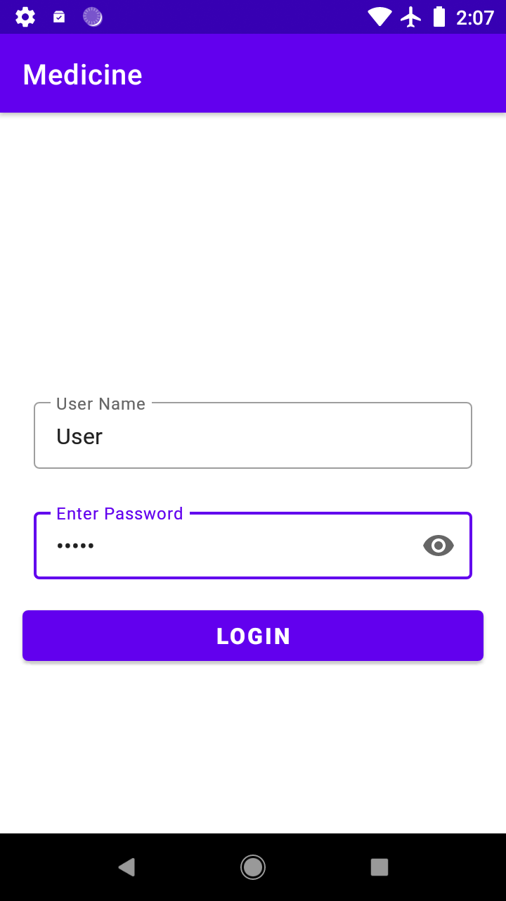
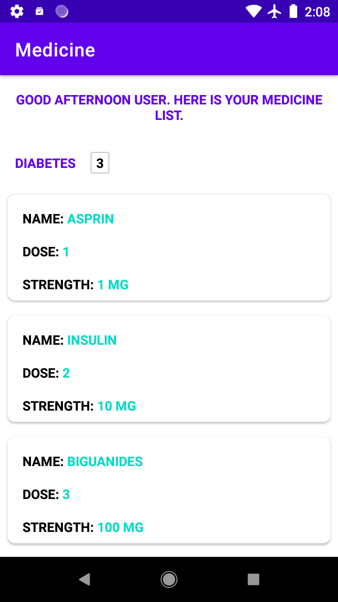
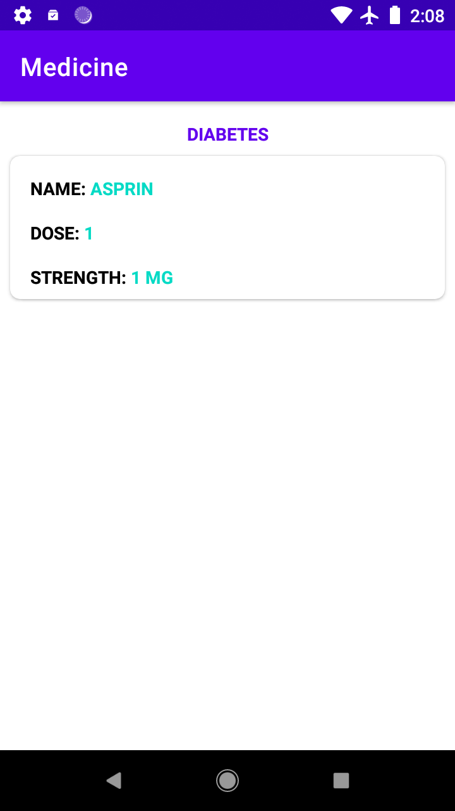

# Medicine
Assignment

# Tech Stack Used:
1. 100 % Kotlin
2. MVVM Clean Artitechture
3. Retrofit for the network calls
4. Room db for offline storage.
5. Kotlin Coroutine for async tasks
6. Dagger Hilt for dependency injection.
7. Navigation Component for screen navigation.
8. View Binding and Nav Safe args to avoid type casting crashes.

# Screenshots With Internet:

 Screenshots Without Internet (Offline Room DB):

